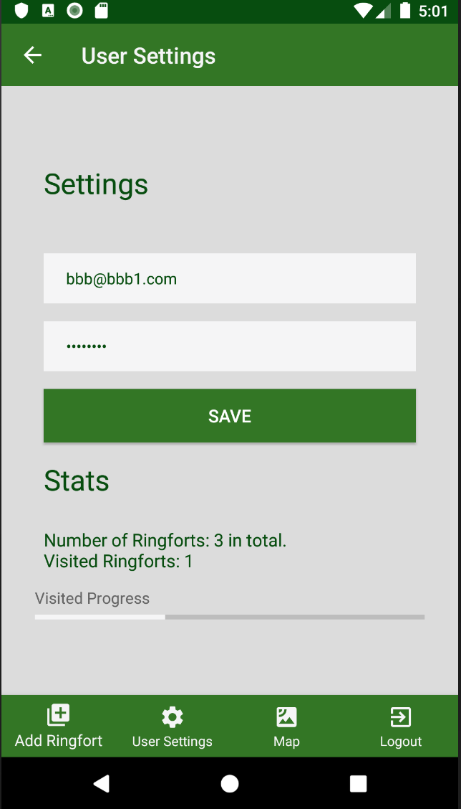

# Mobile AppDev - Ringfort Assignment

Name:  Bernard Thompson
 Student Number: 20020038

***

## Overview.

Android application developed using [Android Studio](https://developer.android.com/studio) and [Kotlin](https://kotlinlang.org/). The application allows archaeology students to explore Archaeological Sites of Interest. 
App should contain a list of sites they have been
assigned to visit.
Users visit site, take photos + notes which augment the
information on the site provided by the app.
Students can add additional sites - which may be
uncharted

***

### List of user features

- Sign up or login with [Firebase](https://firebase.google.com/) Authentication
- Edit user details
- Add/Edit a Ringfort (Name, description, image, location, rating, favourite)
- Delete Ringfort
- List all Ringforts
- View Stats, number of Ringforts and number of Ringforts visited
- Filter ringfort list based on name search
- List only favourite Ringforts by toogling a favourite button
- Display a map with the location of all Ringforts
- Share a ringfort via other applications on device (sms, email etc)
- Application works in both portrait and landscape mode
- Bottom navigation allows user to easily navigate between activities

***

## Run Application

Clone the project

* Open a terminal window and create a new folder `mkdir <foldername>`
* Navigate into the newly created folder `cd <foldername>`
* Clone the project `git clone git@github.com:bonjo7/kotlin_assignment1.git`
* The project folder `kotlin_assignment1` should now be availble, run command `ls` to be sure.
* Open the project in Android Studio and when the project builds it should fail with the following error `File google-services.json is missing`
* To resolve this error
    * Go to, [Firebase](https://console.firebase.google.com/)
    * Select your project, or create a project. This application requires ([Email/Password authentication](https://firebase.google.com/docs/auth/web/password-auth), [realtime database](https://firebase.google.com/docs/database), and [storage](https://firebase.google.com/docs/storage))
    * Once the above has been setup, on the left menu, click on settings > project settings
    * Add an app or download the google-services.json file under the Your Apps section and add the file to the root of the project.
* Rebuild project and project should build without any errors
* Select an [emulator](https://developer.android.com/studio/run/emulator) to run the application or use your own [device](https://developer.android.com/training/basics/firstapp/running-app)
* Once installed the application should be available on the device with the following app icon

### Possible Google maps error

* An error which you may encounter is google maps not displaying. This is due to the application using the wrong SHA1 key when running the applicaiton and attempting to view the map view. In order to chnage the SHA1 key follow the instructions below
   * Open Android Studio
   * Open your Project
   * Click on Gradle (From Right Side Panel, you will see Gradle Bar)
      * Click on Your Project (Your Project Name form List (root))
      * Click on Tasks
      * Click on Android
   * Double Click on signingReport (You will get SHA1 and MD5 in Run Bar(Sometimes it will be in Gradle Console))
   * Open `google_maps_api.xml` and on line 7 enter your SHA1 key
   * Select app module from module selection dropdown to run or debug your application

***

## UI Design.

Screenshots of app's views with brief statements of their use

* SPLASHSCREEN

>> Splash screen displays for four seconds while displaying the laoding icon so the user is aware that the application. Once splashscreen is complete the login activity is then displayed

---

* LOGIN

>> User has the option to login with firebase authentication. If the user currently does not have an account they may select the `Not registered, register here` text which will display the register activity. Email must include `@` and `.` eg `.com, .ie. .co.uk` and password must be 8 characters. If user tries to login without an account a toast message will be displayed stating account does not exist. For existing accounts, the loading icon will display with authentication is taking place

---

* REGISTER

>> User can enter their name, email and password here where the credentials will then be stored on firebase. Once complete the user login activity will be displayed. Only email and password are required here.

---

* ADD/EDIT RINGFORT

>> This activity allows the user to add or edit a ringfort. They may enter the followinf details, ringfort name, description, image (uploaded from gallery), location, if they have visited the ringfort or not, date in which they visited, rating and if it is a favourite of theres by selecting the heart icon. Un selected favourite is displayed as an outline of a heart and selected favourite is displayed as a red heart as seen in the image above

---

* DSIPLAY FAVOURITES

>> A user has the option to only display their favourite ringforts by toogling the heart icon under the search bar. When toogled off this heart is displayed as a white outline heart and displayed as a full red heart when selected. This works by updating the list adapter where only favourites are displayed and is unselected all ringforts are displayed

---

* SEARCH RINGFORTS

>> User may also search both the list of all ringforts and the list of favourite ringforts. The search creteria is based on the ringfort name. As the user begins to enter characters the list us updated accordingly

---

* DISPLAY RINGFORTS ON MAP

>> Once ringforts have been created, and their location has been set they will display on a map. If a location tag is selected it will display the ringfort name, description and image

---

* SHARE RINGFORT

>> On the add/edit ringfort activity, a user may select the `share` button, this will allow the user to send ringfort data via other applications on their device. In the example above the data is being shared via sms. The ringfort name, description, location, rating are sent.

---

* USER SETTINGS

>> A user may update their user details within the settings activity. It also displays the total of ringforts which are available.

---

* LANDSCAPE MODE

>> Instead of creating a layout for landscape mode, after reviewing the android docs I instead added the following line to each activity in the manifest file `android:configChanges="orientation|screenSize|screenLayout|keyboardHidden"` which allows for orientation changes. In the list activity a message is toasted when the user chnages orientation stating if they are in portrait of landscape mode.

---

## Known Bugs
- Updating user details, currently is a user updates their details if does not work as expected, detials are changed but then the user us unable to login
- Saving ringfort, ringfort currently save's but does not redirect to list activity.
- User only allowed to upload one image instead of four.
- Have not implemented the ability to take a photo as of yet
- UI for maps in landscape mode not displaying correctly
